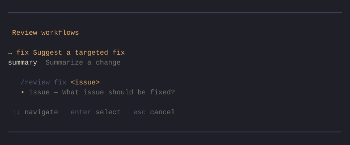

# pi-prompt-composer

Folder-based grouped slash commands for [Pi](https://github.com/badlogic/pi-mono).

<p align="center">
  
</p>

Turn a directory of `.md` prompt files into a single `/command` with Tab-completable subcommands, a rich interactive selector, and automatic missing-argument collection.

## Quick start

```bash
# Install
pi install pi-prompt-composer

# Copy the bundled examples into your project prompt root
mkdir -p .pi/prompts/review
cp -r $(pi resolve pi-prompt-composer)/examples/prompts/review/* .pi/prompts/review/

# Reload Pi, then try:
#   /review           → interactive selector
#   /review summary   → asks for missing "change" arg, then sends
#   /review fix "bug" → dispatches immediately
```

## How it works

A folder with an `_index.md` (containing `type: group`) becomes a grouped command. Every other `.md` file in that folder becomes a subcommand.

```text
.pi/prompts/
├── workspace.md              ← flat Pi prompt, unchanged
├── review/
│   ├── _index.md             ← type: group  →  /review
│   ├── summary.md            ←                  /review summary
│   └── fix.md                ←                  /review fix
```

Both prompt roots are scanned:
- **User**: `~/.pi/agent/prompts/`
- **Project**: `<project>/.pi/prompts/`

Flat `.md` files outside group directories continue to work as native Pi prompts.

## Features

| Feature | Behavior |
|---------|----------|
| **Direct dispatch** | `/review fix "the bug"` → substitutes args, sends immediately |
| **Bare-command selector** | `/review` → rich TUI selector with aligned descriptions and dynamic usage hints |
| **Missing-arg collection** | Prompts with required `args` metadata pause and ask before sending |
| **Autocomplete** | Tab after `/review ` shows subcommand names with descriptions |
| **Unknown subcommand** | Typos show a warning with available alternatives |
| **Escape syntax** | `\$ARGUMENTS` renders as literal `$ARGUMENTS` |
| **Discovery warnings** | Malformed metadata surfaces as Pi notifications on session start |

## Writing prompts

### `_index.md` (required)

```yaml
---
type: group
description: Review workflows
---
```

`type: group` is the hard gate — directories without it are ignored.

### Nested prompt files

```yaml
---
description: Summarize a change
args:
  - name: change
    required: true
    hint: What changed?
  - name: context
    required: false
    hint: Additional context
---
Summarize the following change:
$ARGUMENTS
```

**Argument syntax** is Pi-native: `$1`, `$2`, `$@`, `$ARGUMENTS`, `${@:N}`, `${@:N:L}`.

Use `\$` to escape a literal dollar sign (e.g., `\$ARGUMENTS` renders as `$ARGUMENTS`).

### `args` metadata

Each item needs:

| Field | Required | Default | Notes |
|-------|----------|---------|-------|
| `name` | **yes** | — | Items without `name` are skipped with a warning |
| `required` | no | `false` | Whether the extension asks for this arg when missing |
| `hint` | no | `""` | Shown in the input prompt and selector usage hint |

Parsing is lenient — a missing `hint` or `required` won't break the prompt. Only a missing `name` drops that individual arg item.

## What this package owns vs Pi-native

| Concern | Owned by |
|---------|----------|
| Frontmatter parsing, arg syntax, substitution | **Pi** (reused) |
| Folder → command grouping, selector, arg collection | **pi-prompt-composer** |
| Flat `.md` prompt behavior | **Pi** (unchanged) |
| Command precedence (grouped wins over flat) | **Pi** (extension commands take precedence) |

## Known limitations

See [`docs/ISSUES.md`](docs/ISSUES.md) for tracked defects and status.

## Non-goals (this version)

- No shell substitution or preprocessing
- No nesting deeper than `/group subcommand`
- No aliases or dynamic subcommands

## Development

```bash
bun install
bun run typecheck && bun run lint && bun run test
```

Autofix: `bun run fix` · Watch: `bun run test:watch`

## License

[MIT](LICENSE)
