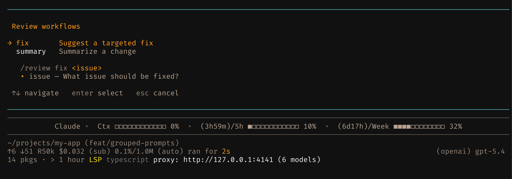

# pi-prompt-composer

Build composer-owned slash commands from plain Markdown prompts — flat files, grouped menus, typed args, Liquid templating, and visible dispatch for [Pi](https://github.com/badlogic/pi-mono).

<p align="center">
  
</p>

Turn `.md` files under `composed/` into single slash commands, or turn directories into grouped commands with Tab-completable subcommands, a rich interactive selector, automatic missing-argument collection, and optional Liquid-powered rendering.

## Quick start

```bash
# Install
pi install pi-prompt-composer

# Copy the bundled examples into your project composer root
mkdir -p .pi/composed/review
cp -r $(pi resolve pi-prompt-composer)/examples/prompts/review/* .pi/composed/review/

# Reload Pi, then try:
#   /review           → interactive selector
#   /review summary   → asks for missing "change" arg, then sends
#   /review fix "bug" → dispatches immediately

# Or create a single Liquid-powered command
cat > .pi/composed/ship.md <<'EOF'
---
description: Prepare a ship checklist
engine: liquid
args:
  - name: change
    required: true
    hint: What changed?
---
Prepare release checklist for {{ args.change | quote }}.

- typecheck
- lint
- tests
- docs

EOF
#   /ship --change "composed prompt discovery"
```

## How it works

Composer-owned prompts live under `composed/` roots so Pi does not also load them as native flat prompts.

```text
.pi/composed/
├── review.md                 ← /review
└── review/
    ├── _index.md             ← /review
    ├── summary.md            ← /review summary
    └── fix.md                ← /review fix
```

Composer roots:
- **User**: `~/.pi/agent/composed/`
- **Project**: `<project>/.pi/composed/`

Native Pi prompt roots (`~/.pi/agent/prompts/*.md`, `.pi/prompts/*.md`) stay native. Existing grouped prompts under `prompts/<group>/` are migrated once into `composed/<group>/` with a warning.

## Features

| Feature | Behavior |
|---------|----------|
| **Flat composer commands** | `.pi/composed/review.md` → `/review` without creating a fake group |
| **Grouped commands** | `.pi/composed/review/summary.md` → `/review summary` |
| **Liquid templating** | `engine: liquid` unlocks `if`, `for`, `where`, `map`, `join`, structured XML blocks, JSON snippets, and command-batch rendering |
| **Direct dispatch** | `/review fix "the bug"` → substitutes args, sends immediately |
| **Bare-command selector** | `/review` → rich TUI selector with aligned descriptions and dynamic usage hints |
| **Missing-arg collection** | Prompts with required `args` metadata pause and ask before sending |
| **Autocomplete** | Tab after `/review ` shows subcommand names with descriptions |
| **Safe helpers** | `present`, `quote`, `tokens`, `json`, `shell_quote`, and `` help build Claude Code skill-style prompts |
| **Escape syntax** | `\$ARGUMENTS` renders as literal `$ARGUMENTS` in `engine: pi` prompts |
| **Discovery warnings** | Malformed metadata and misplaced composer prompts surface as Pi notifications on session start |
| **Bundled `/compose`** | Built-in helpers for creating, extending, and simplifying grouped prompts |
| **Authoring skill** | Comprehensive `compose-grouped-prompts` skill loaded on demand for deep guidance |

## Bundled `/compose` command

The package ships a built-in `/compose` grouped command for authoring grouped prompts:

| Command | Purpose |
|---------|---------|
| `/compose` | Interactive selector for compose operations |
| `/compose new <group-name>` | Create a new grouped prompt set |
| `/compose add <group-name>` | Add subcommands to an existing group |
| `/compose remove <group-name>` | Remove or simplify a subcommand |

The bundled `/compose` is loaded with lowest precedence. If you create your own `compose/` group in user or project prompts, it overrides the built-in version.

### Required tools

The `/compose` prompts work best with [`pi-ask-user`](https://www.npmjs.com/package/pi-ask-user) installed — it provides the `ask_user` tool for interactive decision handshakes during prompt authoring. If required tools are missing, a persistent warning banner appears at session start:

```
 Missing tools: ask_user — run pi install pi-ask-user
```

### Authoring skill

The package also ships a `compose-grouped-prompts` skill with:

- Workflow guidance for creating, adding, and removing prompts
- Layout conventions and naming rules
- Frontmatter and args reference
- Realistic examples and anti-patterns

The skill is loaded on demand when the model needs deeper guidance beyond what the `/compose` prompts provide.

## Writing prompts

### `_index.md` (required for groups)

```yaml
---
description: Review workflows
order: [summary, fix]
---
```

No `type: group` marker is required. A subfolder under `composed/` with `_index.md` is a group.

`order` is optional — controls subcommand display order in autocomplete and the selector. Listed names appear first in the given order; unlisted subcommands are appended alphabetically. Omit for default alphabetical ordering.

### Flat composer prompt files

```yaml
---
description: Review a change
engine: liquid
args:
  - name: change
    required: true
    hint: Change, diff, file, or PR to review
  - name: focus
    required: false
    hint: Optional focus
---
Review {{ args.change | quote }}.


Focus on: {{ args.focus }}

```

Save as `.pi/composed/review.md`, then run `/review --change "auth fix" --focus security`.

### Nested prompt files

```yaml
---
description: Summarize a change
args:
  - name: change
    required: true
    hint: What changed?
  - name: context
    required: false
    hint: Additional context
---
Summarize the following change:
$ARGUMENTS
```

**Argument syntax** defaults to Pi-native: `$1`, `$2`, `$@`, `$ARGUMENTS`, `${@:N}`, `${@:N:L}`. Add `engine: liquid` to use named args (`{{ args.change }}`), conditionals, loops, and filters.

Use `\$` to escape a literal dollar sign (e.g., `\$ARGUMENTS` renders as `$ARGUMENTS`).

### `args` metadata

Each item needs:

| Field | Required | Default | Notes |
|-------|----------|---------|-------|
| `name` | **yes** | — | Items without `name` are skipped with a warning |
| `required` | no | `false` | Whether the extension asks for this arg when missing |
| `hint` | no | `""` | Shown in the input prompt and selector usage hint |

Parsing is lenient — a missing `hint` or `required` won't break the prompt. Only a missing `name` drops that individual arg item.

## Liquid helpers

Liquid prompts get `{ args, prompt }` as their render context:

```liquid
{{ args.change | quote }}
{{ args.items | where: "kind", "risk" | map: "name" | join: ", " }}
{{ args.metadata | json: 2 }}
{{ args.workdir | shell_quote }}
{{ args.goal }}
```

Useful helpers:

| Helper | Purpose |
|--------|---------|
| `present` | True for non-empty strings/arrays |
| `quote` | Trim and double-quote text |
| `tokens` | Rough chars/4 estimate |
| `json` | JSON stringify values, optionally pretty-printed |
| `shell_quote` | Single-quote shell arguments for command text |
| `` | Emit XML-style blocks only when rendered body is non-empty |
| `...` | Render a command and optionally execute it when `shell` frontmatter opts in |

Shell execution is deny-by-default:

| Frontmatter | Behavior |
|-------------|----------|
| omitted / `shell: deny` | Show command text; do not execute |
| `shell: ask` | Confirm before execution; stdout replaces the block |
| `shell: allow` | Execute without asking; trusted prompts only |

Configure the default in `~/.pi/agent/prompt-composer.json` or project-local `.pi/prompt-composer.json`:

```json
{
  "shell": { "mode": "ask", "timeoutMs": 30000 }
}
```

Prompt frontmatter wins over config.

Shell blocks run with `bash -lc` from the prompt file directory, so relative scripts work:

```liquid

python3 scripts/summarize.py --topic {{ args.topic | shell_quote }}

```

This is opt-in because shell can read files, call networks, mutate repos, or expose secrets. Quote user-controlled args with `shell_quote`. See [docs/TEMPLATING.md](docs/TEMPLATING.md) and [examples/templating/README.md](examples/templating/README.md).

Composer does not pretend to sandbox commands. Portable sandboxing is platform-specific; shell-enabled prompts are trusted code, matching Pi's normal shell trust model.

## What this package owns vs Pi-native

| Concern | Owned by |
|---------|----------|
| Frontmatter parsing, arg syntax, substitution | **Pi** (reused) |
| Folder → command grouping, selector, arg collection | **pi-prompt-composer** |
| Native flat `.md` prompt behavior under `prompts/` | **Pi** (unchanged) |
| Composer flat `.md` prompt behavior under `composed/` | **pi-prompt-composer** |
| Command precedence (grouped wins over flat) | **Pi** (extension commands take precedence) |

## Known limitations

See [`docs/ISSUES.md`](docs/ISSUES.md) for tracked defects and status.

## Non-goals (this version)

- No default shell execution from templates; shell remains explicit opt-in
- No nesting deeper than `/group subcommand`
- No aliases or dynamic subcommands

## Development

```bash
pnpm install
pnpm run typecheck && pnpm run lint && pnpm run test
```

Autofix: `pnpm run fix` · Watch: `pnpm run test:watch`

## Related packages

| Package | Description |
|---------|-------------|
| [`@victor-software-house/pi-openai-proxy`](https://www.npmjs.com/package/@victor-software-house/pi-openai-proxy) | OpenAI-compatible HTTP proxy for Pi's multi-provider model registry |

## License

[MIT](LICENSE)
